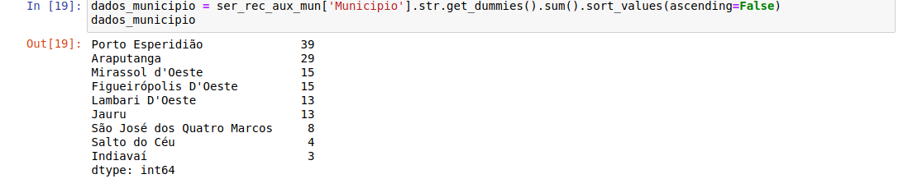

# Analise de dados auxilio emergencial
#### Vale do Jauru
- Localizada no interior do estado do Mato Grosso especifica sendo a micro região da Mesorregião do Sudoeste Mato-Grossense;

- Ademais a região é composta pelos seguintes municipios:
	* Araputanga
	* Figueirópolis d'Oeste
	* Glória d'Oeste
	* Indiavaí
	- Jauru
	- Lambari d'Oeste
	- Mirassol d'Oeste
	- Porto Esperidião
	- Reserva do Cabaçal
	- Rio Branco
	- Salto do Céu
	- São José dos Quatro Marcos

Analise superficial **homonimos**

